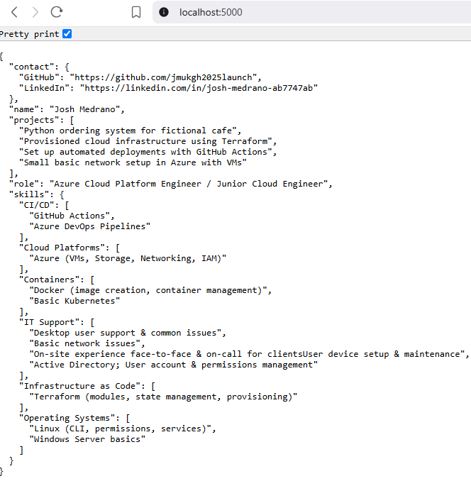
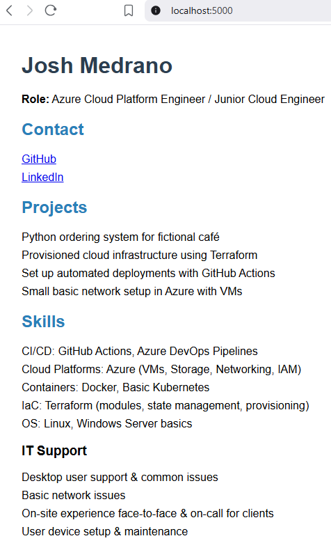

# Resume API (Local DevOps Project)

## What is this?

A simple API that returns a resume message.  
Built with Flask, Dockerized, and deployed with GitHub Actions CI/CD.

## How to Run Locally

```bash
docker build -t resume-api .
docker run -p 5000:5000 resume-api
```

## Project Screenshots

### 1. Original Localhost test page


### 2. Resume shot - Raw JSON version


### 3. Resume shot - HTML & CSS version


### 4. Docker

